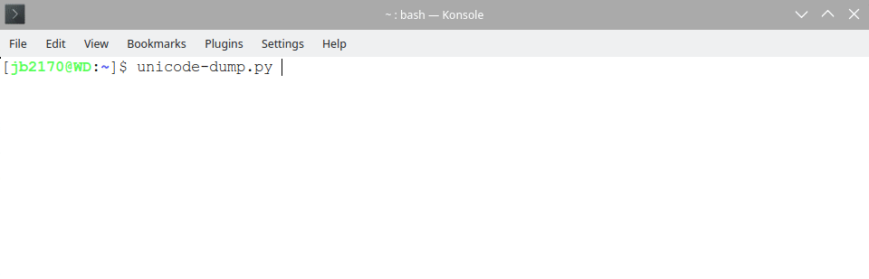

# UnicodeDump

Like hexdump but for Unicode codepoints. Pass strings on the command line, or read from stdin. The script converts UTF-8 (or your system's default encoding?) to formatted codepoints.

## Examples

### CLI args

`$ ./src/unicode-dump.py Hello, שלום עליכם`

```
H U+0048   e U+0065   l U+006C   l U+006C   o U+006F   , U+002C     U+0020   ש U+05E9
ל U+05DC   ו U+05D5   ם U+05DD     U+0020   ע U+05E2   ל U+05DC   י U+05D9   כ U+05DB
ם U+05DD
```

### Reading from stdin



### Printable ASCII

`$ python3 -c 'for i in range(128): print(chr((i % 8) * 16 + (i // 8)), end = "")' | unicode-dump.py`

```
. U+0000   . U+0010     U+0020   0 U+0030   @ U+0040   P U+0050   ` U+0060   p U+0070
. U+0001   . U+0011   ! U+0021   1 U+0031   A U+0041   Q U+0051   a U+0061   q U+0071
. U+0002   . U+0012   " U+0022   2 U+0032   B U+0042   R U+0052   b U+0062   r U+0072
. U+0003   . U+0013   # U+0023   3 U+0033   C U+0043   S U+0053   c U+0063   s U+0073
. U+0004   . U+0014   $ U+0024   4 U+0034   D U+0044   T U+0054   d U+0064   t U+0074
. U+0005   . U+0015   % U+0025   5 U+0035   E U+0045   U U+0055   e U+0065   u U+0075
. U+0006   . U+0016   & U+0026   6 U+0036   F U+0046   V U+0056   f U+0066   v U+0076
. U+0007   . U+0017   ' U+0027   7 U+0037   G U+0047   W U+0057   g U+0067   w U+0077
. U+0008   . U+0018   ( U+0028   8 U+0038   H U+0048   X U+0058   h U+0068   x U+0078
. U+0009   . U+0019   ) U+0029   9 U+0039   I U+0049   Y U+0059   i U+0069   y U+0079
. U+000A   . U+001A   * U+002A   : U+003A   J U+004A   Z U+005A   j U+006A   z U+007A
. U+000B   . U+001B   + U+002B   ; U+003B   K U+004B   [ U+005B   k U+006B   { U+007B
. U+000C   . U+001C   , U+002C   < U+003C   L U+004C   \ U+005C   l U+006C   | U+007C
. U+000D   . U+001D   - U+002D   = U+003D   M U+004D   ] U+005D   m U+006D   } U+007D
. U+000E   . U+001E   . U+002E   > U+003E   N U+004E   ^ U+005E   n U+006E   ~ U+007E
. U+000F   . U+001F   / U+002F   ? U+003F   O U+004F   _ U+005F   o U+006F   . U+007F
```
